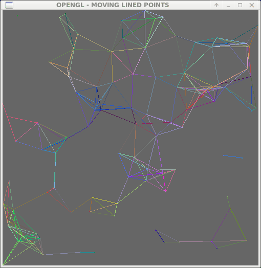

# Tutorial of GLUT: animation of moving line-point

In this tutorial, we will use GLUT to implement a simple 3D lined-point animation, like this:


## Install GLUT
What is GLUT? GLUT is OpenGL Utility Toolkit, which relies on Mesa library. Mesa is the open-source implementation of OpenGL, which is a trademark of Silicon Graphics and an graphics library of c++. OpenGL is more than 25 years old and still used in Linux. GLUT is designed for constructing small to medium sized OpenGL programs.

To install it in Debian, we need 
``` apt install freeglut3 freeglut3-dev libglew-dev```
In Debian, freeglut3 is the GLUT we use. 

## Triangle
First of all, a hello-world in GUI is a triangle. 
```
triangle.cc
```
The code is straightforward. We have a main loop: glutMainLoop(). In this loop, the display function will be repeatedly called. Our job is to provide a proper display functions. 

## Random Points
Next, we generate some random points. This code demonstrates the random library we use:
```
point.cc
```
It also demonstrates the function `glPointSize`; this function should be called outside of glBegin. In the other hand, glColor3f could be called inside glBegin. 

## Cube
Next, we demonstrate a cube. 
```
cube.cc
```
In this code, we demonstrate three things:
1. We can use multiple triangles to construct a plane, which is the basic of 3D modeling. 
2. keyboard function is registered to glutSpecialFunc, which controls the special keyboard input. 
3. Rotation of the coordinates by glRotatef();
In this demonstration, we can use the left/right/up/down key to rotate the cube. 

## linepoint
Let us connect the point within a given range.
```
linepoint.cc
```
In this code, we demonstrate the animiation of points and the connect the points if they are close enough. By calculating the distance between two points, we can know whether to connect them or not. The connection is done by drawing a line (gl_LINES). 

By defining two functions (forward and backward) and binding them to left and right key, we are able to update the points fowards or backwards. 

The points bound back when they hit the boundaries. 

## 2D animation
Now, we are able to build a 2D animation based on the above codes.
```
movinglp.cc
```
The only thing we need to do is to call the forward function in the display function. The loop will update the points accordingly. 



## 3D animation
Finally, we are able to build a 3D animation. To make it easier to see, we build a cube frame in the origin. We also demonstrate the keyboard by glutKeyboardFunc().
```
movinglp3d.cc
```

## Large-scale 3D animation
To use it in large-scale (with more than 1,000,000 points, we need to structure it in C++ way and employ the octree-based update, which is out of the scope of this tutorial. 

## Conclusion
OpenGL is a low-level and efficient library for graphics. It is pretty old, and Apple does not support OpenGL in the latest MaCOS anymore. It is recommended to use more advanced library such as GTK+ and QT to build GUI programs. However, for small and medium demo, it is still very straightfowrd and efficient. 
